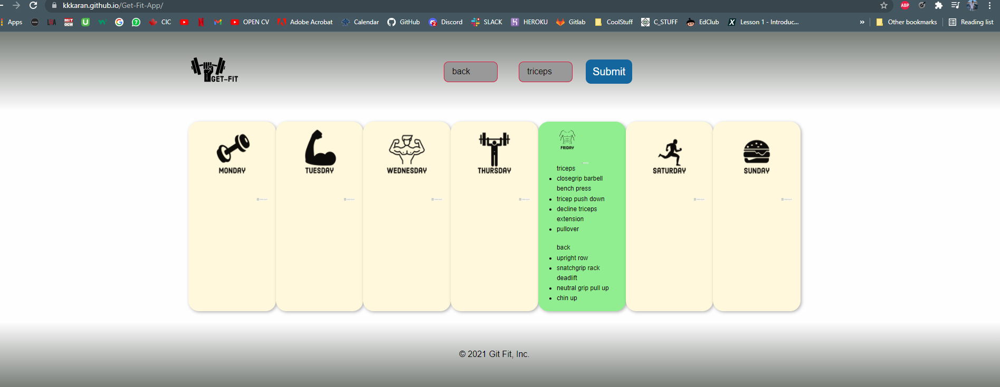

# Project 1 - Get-Fit
# Get-Fit is an application that will randomize your daily or weekly work-outs to focus on strength, cardio, functional fitness and core training.

#The app is live # @https://kkkaran.github.io/Get-Fit-App/
My upload link:https://avneetk3.github.io/Project1Upload/index.html

# Functionality:
# The user is presented with a random set of exercises that focuses on certain areas of body regions when he selects the two muscle groups of his choice.

# Specifications:

# CSS framework used is Foundation.
# Made the use of Modals
# The app is completely responsive and adjusts on the screen accordingly.

# API:
# Our team created our own custom API. WE used node and express for backend and deployed it on the Heroku server to make it online.
# The API is  @https://getfitapifinal.herokuapp.com/exercises.
# There are 2 API calls made: One for fetching the body muscles and populating the select tag.
# When the user makes his choice, the API call fetches the corresponding exercises and displays in the current day card.

# Local Storage:
# Local Storage is used to store the exercises in the corresponding day so as display the same exercises in the same at the time of refresh.

